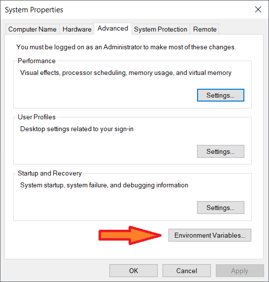

# Apache Spark

## I. Overview - Introduction

### 1.1 What is Apache Spark™?

- Apache Spark™ is a multi-language engine for executing data engineering, data science, and machine learning on single-node machines or clusters.
- A unified analytics engine for large-scale data processing. Spark is written in Scala, but provides rich APIs in  Scala, Java, Python and R, and an optimized engine that supports general execution graphs. It also supports a rich set of higher-level tools including [Spark SQL](https://spark.apache.org/docs/3.3.1/sql-programming-guide.html) for SQL and structured data processing, [pandas API on Spark](https://pandas.pydata.org/) for pandas workloads, [MLlib](https://spark.apache.org/docs/3.3.1/ml-guide.html) for machine learning, [GraphX](https://spark.apache.org/docs/3.3.1/graphx-programming-guide.html) for graph processing, and Structured Streaming for incremental computation and stream processing.
- A lightning-fast cluster computing technology, designed for fast computation. It is based on Hadoop MapReduce and it extends the MapReduce model to efficiently use it for more types of computations, which includes interactive queries and stream processing. The main feature of Spark is its in-memory cluster computing that increases the processing speed of an application.

### 1.2 Fundamental - Basic Concept

#### Resilient Distributed Datasets - RDD

**The key abstraction of Spark knows as RDD.**

- Spark makes use of the concept of RDD to achieve faster and efficient [MapReduce](https://en.wikipedia.org/wiki/MapReduce) operations.
- Resilient Distributed Datasets (RDD) is a fundamental data structure of Spark. It is an immutable distributed collection of objects. Each dataset in RDD is divided into logical partitions, which may be computed on different nodes of the cluster. RDDs can contain any type of Python, Java, or Scala objects, including user-defined classes.
  - **-> Dataset**: RDD is a bunch of rows of data in some sort.
  - **-> Distributed**: Because it's divided into row, those rows can be distributed out to different computers and be processed in parallel on those different computers.
  - **-> Resilient**: Spark makes sure the processing that we're doing on the RDD gets done one way or another, if a node goes down in the middle of operation and to spin up a new one to take its place.
- Apache Spark RDDs support two types of operations:
  - Transformation – Creates a new RDD from the existing one. It passes the dataset to the function and returns new dataset.
  - Action – Spark Action returns final result to driver program or write it to the external data store.
- Features of Spark RDD
  - 

##### Read more: [Resilient Distributed Datasets-RDD](https://data-flair.training/blogs/spark-rdd-tutorial/)

#### Directed Acyclic Graph (DAG)

- Directed Acyclic Graph DAG in Apache Spark is a finite direct graph with no directed cycles - a set of Vertices and Edges, where vertices represent the RDDs and the edges represent the Operation to be applied on RDD. In Spark DAG, every edge directs from earlier to later in the sequence. On the calling of Action, the created DAG submits to DAG Scheduler which further splits the graph into the stages of the task. Each node is an RDD partition, and the edge is a transformation on top of data.


##### Read more [Directed Acyclic Graph (DAG)](https://data-flair.training/blogs/dag-in-apache-spark/)

### 1.3 Spark Architecture

- The Spark architecture depends upon two abstractions:
  - Resilient Distributed Dataset (RDD)
  - Directed Acyclic Graph (DAG)

Apache Spark uses master-slave architecture.


- Master manages, maintains, and monitors the slaves while slaves are the actual workers who perform the processing tasks.
- In the Spark environment, master nodes are referred to as drivers, and slaves are referred to as executors.
  - Drivers

    ```txt
    - Drivers are the master process in the Spark environment. It contains all the metadata about slaves or, in Spark terms, executors.
    - Drivers are responsible for: Analyzing, Distributing, Scheduling, and Monitoring the executors.
    ```

  - Executors

    ```txt
    Executors are the slave processes in the Spark environment. They perform the data processing which is assigned to them by their master.
    ```

### 1.4 Components of Spark


- Apache Spark Core

    ```txt
    Spark Core is the underlying general execution engine for spark platform that all other functionality is built upon. It provides In-Memory computing and referencing datasets in external storage systems.
    ```

- Spark SQL

    ```txt
    Spark SQL is a component on top of Spark Core that introduces a new data abstraction called SchemaRDD, which provides support for structured and semi-structured data.
    ```

  - Spark SQL engine: under the hood
  Apache Spark™ is built on an advanced distributed SQL engine for large-scale data

- Spark Streaming

    ```txt
    Spark Streaming leverages Spark Core's fast scheduling capability to perform streaming analytics. It ingests data in mini-batches and performs RDD (Resilient Distributed Datasets) transformations on those mini-batches of data.
    ```

- MLlib (Machine Learning Library)

    ```txt
    MLlib is a distributed machine learning framework above Spark because of the distributed memory-based Spark architecture. It is, according to benchmarks, done by the MLlib developers against the Alternating Least Squares (ALS) implementations. Spark MLlib is nine times as fast as the Hadoop disk-based version of Apache Mahout (before Mahout gained a Spark interface).
    ```

- GraphX

    ```txt
    GraphX is a distributed graph-processing framework on top of Spark. It provides an API for expressing graph computation that can model the user-defined graphs by using Pregel abstraction API. It also provides an optimized runtime for this abstraction.
    ```

### 1.5. Features

Apache Spark has following features.

- Batch/streaming data: unify the processing of your data in batches and real-time streaming, using your preferred language: Python, SQL, Scala, Java or R.
- Speed − Spark helps to run an application in Hadoop cluster, up to 100 times faster in memory, and 10 times faster when running on disk. This is possible by reducing number of read/write operations to disk. It stores the intermediate processing data in memory.
- Data science at scale: Perform Exploratory Data Analysis (EDA) on petabyte-scale data without having to resort to downsampling
- Machine learning: Train machine learning algorithms on a laptop and use the same code to scale to fault-tolerant clusters of thousands of machines.
- Advanced Analytics − Spark not only supports ‘Map’ and ‘reduce’. It also supports SQL queries, Streaming data, Machine learning (ML), and Graph algorithms.

## II. Installation

- Note:
  - This doc was written/last updated on `25/12/2022`, so the version of the tool/software worked well/stable at that time.
  - These instruction steps are on Window OS, steps are equivalent on other systems.
    - [Linux | Ubuntu](https://sparkbyexamples.com/spark/spark-installation-on-linux-ubuntu/)
    - [Mac](https://sparkbyexamples.com/spark/install-apache-spark-on-mac/)
  - Setting Environment Variables using CLI/GUI on the target system:
    - Window:
      - CLI: CMD/Window PowerShell
        - command `set` (CMD) or `setx` (PowerShell).
        - Example: `setx VAR=/target/path/`
        - then append new variable to `$PATH`:
          - `set/setx /M PATH "$env:PATH;$env:VAR\target\path"`
      - GUI:
        - Start Menu -> search `System Environment Variables`
        - -> click to open window then select `Environment Variables`
        
        - > New > input Variable Name and Variable Value is `/target/path/`
        
        - Then append new variable to `$PATH`: click edit then add new
          - Example: `%SPARK_HOME%\bin`
        
        
    - Unix CLI: bash, zsh
      - command `export`. Example: `export VAR=/target/path`
      - then append new variable to `$PATH`: `export PATH=$PATH:$VAR/bin`

### 2.1 Install Java 8 or Later

- Spark is written in Scala, so the runtime env is JVM
- Download and install Java version from [Oracle](https://www.oracle.com/technetwork/java/javase/downloads/jdk8-downloads-2133151.html) or [OpenJDK](https://www.openlogic.com/openjdk-downloads) and install it on system.
- After install, set `JAVA_HOME` environment variable. Example:
  
    ```console
    set JAVA_HOME = C:\Program Files\Java\jdk.[installed-version]
    set PATH = %PATH%;%JAVA_HOME%
    ```

### 2.2 Install Spark

- Download Spark compressed tar/zip file from [Spark Download](https://spark.apache.org/downloads.html)
  - Choose Spark release: `3.3.1`
  - Package Type: `Pre-built for Apache Hadoop 3.3 and later`
  - Download: `Download Spark (point 3 from below screenshot)`
  - 
- After download, untar/unzip the binary using 7zip or any zip utility to extract the zip file and copy the extracted directory spark-3.3.1-bin-hadoop3.3 to `c:\apps\spark-3.3.1-bin-hadoop3.3`

- Spark Environment Variables:

    ```console
    set SPARK_HOME  = C:\apps\spark-3.3.1-bin-hadoop3.3
    set HADOOP_HOME = C:\apps\spark-3.3.1-bin-hadoop3.3
    PATH=%PATH%;%SPARK_HOME%
    ```

- Spark on Windows OS with `winutils.exe`: to run Apache Spark on windows, need `winutils.exe` as it uses POSIX like file access operations in windows using windows API.
  - [Download winutils.exe for Hadoop](https://github.com/steveloughran/winutils) and copy it to `%SPARK_HOME%\bin` folder.

## III. Checking Installation and Testing

### 3.1 Apache Spark shell

- `spark-shell` is a CLI utility that comes with Apache Spark distribution, open CLI, go to `cd %SPARK_HOME%/bin` and type `spark-shell` command to run Apache Spark shell.
- Spark-shell also creates a Spark context web UI and by default, it can access from <http://localhost:4040>.
- On spark-shell command line check spark version by command:
  - Type: `spark.version` then press Enter

- 

### 3.2 Spark-submit

`The spark-submit script in Spark’s bin directory is used to launch applications on a cluster. It can use all of Spark’s supported cluster managers through a uniform interface so you don’t have to configure your application especially for each one.`

- Launching Applications with `%SPARK_HOME%/bin/spark-submit`: once a Spark application is bundled, it can be launched using the bin/spark-submit script.

  ```shell
  ./bin/spark-submit \
    --class <main-class> \
    --master <master-url> \
    --deploy-mode <deploy-mode> \
    --conf <key>=<value> \
    ... # other options
    <application-jar> \
    [application-arguments]
  ```

  - `--class`: The entry point for your application (e.g. org.apache.spark.examples.SparkPi)
  - `--master`: The master URL for the cluster (e.g. spark://23.195.26.187:7077)
  - `--deploy-mode`: Whether to deploy your driver on the worker nodes (cluster) or locally as an external client (client) (default: client) †
  - `--conf`: Arbitrary Spark configuration property in key=value format. For values that contain spaces wrap “key=value” in quotes (as shown). Multiple configurations should be passed as separate arguments. (e.g. `--conf <key>=<value> --conf <key2>=<value2>`)
  - `application-jar`: Path to a bundled jar including your application and all dependencies. The URL must be globally visible inside of your cluster, for instance, an hdfs:// path or a file:// path that is present on all nodes.
  - `application-arguments`: Arguments passed to the main method of your main class, if any

- Example: run a .jar on standalone Spark local

  ```shell
  # Run application locally on 8 cores
  ./bin/spark-submit \
    --class org.apache.spark.examples.SparkPi \
    --master local[8] \
    /path/to/examples.jar \
    100
  ```

#### Read more [Spark-submit](https://spark.apache.org/docs/latest/submitting-applications.html)

### 3.3 Hand on simple example

#### Analyze CNCF([**Cloud Native Computing Foundation**](https://landscape.cncf.io/)) data

- Target: aggregate CNCF data to get a statistics about the organization's product, ranking, contribute,... on Cloud 
  Technologies.
- Implementation's method: using Spark-shell to interactive result.
- Input data: [interactive-landscape.csv](./interactive-landscape.csv)(Get from this `spark-guideline` folder).
  - In this example's code, place the file to target directory: `C:/interactive-landscape.csv`
- Spark-shell code:
  - Change the input/output directory file path in the code if there is difference:
    - change path in `.csv("file:///{target-path}")`

  ```scala
  
  import org.apache.hadoop.fs.{FileSystem, Path}
  import org.apache.spark.sql.functions._

  val rawDf = spark.read.option("delimiter",",").option("header",value=true)
      // Input data: directory that contains the input data file interactive-landscape.csv
      .csv("file:///C:/interactive-landscape.csv") 

  val aggOrgDf = rawDf.na
        .drop("any", Array("Organization"))
        .groupBy("Organization")
        .agg(
          countDistinct("Name").alias("Total_Products"),
          sum(col("Github Stars")).alias("Total_stars"),
          max("Github Start Commit Date").alias("Latest_Commit_Date")
        )
        .selectExpr(
          Seq(
            "Organization",
            "Total_Products",
            "Total_stars",
            "Lastest_Commit_Date"
          ): _*
        )
        .orderBy(desc("Total_Products"))

  val finalDf = aggOrgDf.orderBy(desc("Total_Products")) // .selectExpr(schema: _*)

  finalDf
        .repartition(1)
        .write
        .mode("overwrite")
        .option("delimiter", "\t")
        .option("header", true)
        .csv("file:///C:/cncf-output.csv") // Output: directory that places the output file
  ```

- Check output: `C:/cncf-output.csv`
- To run this example with Spark-submit:
  - Build & package the source-code folder `cncf-analysis` as sbt project
  - Run submit command: syntax format in **3.1**
